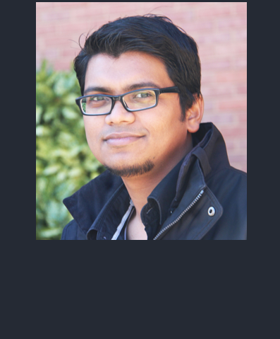

<section id="principal investigator">
  

    

      

        
      

    

    

      <h2>Aaron Sathyanesan, PhD </h2>
      
Aaron did his undergrad in Bioengineering at Bharathidasan University, India, followed by a junior research fellowship in biophysics at the AU-KBC Resarch Center in Chennai, India. He then moved to the US to complete his PhD in neuroscience at UMBC with Dr. Weihong Lin. He completed his postdoctoral fellowship with Dr. Vittorio Gallo at the Children's National Research Institute in Washington DC, followed by a research faculty position also at Children's National. Aaron joined UD as a tenure-track assitant professor in 2022.

      
Also, Tolkien Supernerd.

    

  

</section>
<section id="Students">
  

    

      

        
      

    

    

      <h2>Mir Abbas Raza, M.Tech</h2>
      
Abbas completed his bachelors and masters in technology majoring in biotechnology from Sathyabama Institute of Science and Technology, Chennai, India. He is currently pursuing a PhD in Biology in the Sathyanesan Lab at UD. Abbas is fascinated by the neuronal connections that make up the nervous system and how they enable complex behaviours. His current focus is to explore the cerebellum and its connections in order to better understand its role in Down Syndrome. When not doing research, he is a <a href="https://www.amazon.com/Serenity-Ink-Mir-Abbas-Raza/dp/1948321084/ref=sr_1_1?crid=1D39H5T1NS7AV&keywords=serenity+in+ink+raza&qid=1691472798&sprefix=serenity+in+ink+raza%2Caps%2C199&sr=8-1">self-proclaimed poet</a>, a loving uncle and a geek about all things Marvel and DC.

    

  

</section>
<section id="Students">
  

    

      

        
      

    

    

      <h2>Amelia Moore</h2>
      
Amelia recently completed her B.S. in Biology at UD while also playing as a student-athlete on the UD Women's Volleyball team. She has always had a passion to pursue a career in the medical field and plans to attend medical or veterinary school. Amelia is currently pursuing an M.S. in Biology at UD and looks forward to exploring and making research discoveries in neuroscience, particularly to help patients affected by Down syndrome.

    

  

</section>