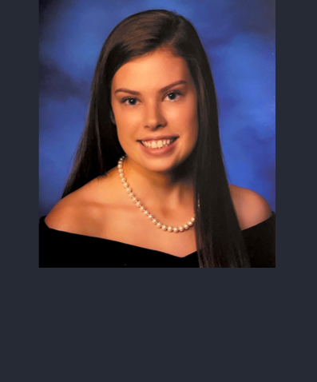

<section id="People">
  

    

      

        
      

    

      

          <h2>Aaron Sathyanesan, PhD</h2>
          
 Aaron did his undergrad in Bioengineering at Bharathidasan University, India, followed by a junior research fellowship in biophysics at the AU-KBC Resarch Center in Chennai, India. He then pursued his PhD with Dr. Weihong Lin at UMBC. He completed his postdoctoral fellowship with Dr. Vittorio Gallo at Children's National, Washington DC, followed by a research faculty position at Children's. Aaron joined UD as a tenure-track assitant professor in the department of biology in 2022. He has a joint appointment in the department of electrical and computer engineering.

          
Also, Tolkien Supernerd.

      

  

</section>
<section id="Students">
  

    

      

        
      

    

    

      <h2>Mir Abbas Raza, M.Tech</h2>
      <h3>PhD Student</h3>
      
Abbas completed his bachelors and masters in technology majoring in biotechnology from Sathyabama Institute of Science and Technology, Chennai, India. He is currently pursuing a PhD in Biology in the Sathyanesan Lab at UD. For his doctoral research, Abbas is focusing on the cerebellar connectome and how it develops, in order to better understand its role in Down Syndrome. When not doing research, he is a <a href="https://www.amazon.com/Serenity-Ink-Mir-Abbas-Raza/dp/1948321084/ref=sr_1_1?crid=1D39H5T1NS7AV&keywords=serenity+in+ink+raza&qid=1691472798&sprefix=serenity+in+ink+raza%2Caps%2C199&sr=8-1" target="_blank">poet</a>, a loving uncle and a geek about all things Marvel and DC.

    

  

</section>
<section id="Students">
  

    

      

        
      

    

    

      <h2>Amelia Moore</h2>
      <h3>MS Student</h3>
      
Amelia recently completed her B.S. in Biology at UD while also playing as a student-athlete on the UD Women's Volleyball team. She has always had a passion to pursue a career in the medical field and plans to attend medical or veterinary school. Amelia is currently pursuing an M.S. in Biology at UD and looks forward to exploring and making research discoveries in neuroscience, particularly to help patients affected by Down syndrome.&emsp;&emsp;&emsp;&emsp;
      &emsp;
      

    

  

</section>
<section id="Students">
  

    

      

        
      

    

    

      <h2>Abigayle Hahn</h2>
      <h3>Undergraduate</h3>
      
Abbey is in her second year as a Pre-Medical major at UD. She hopes to pursue a medical career in the field of fetal medicine. She is excited to investigate different neurodevelopmental disorders and getting to play with some mice! In her free time, you can find her singing karaoke with the residents of the nursing home she works at back in Pittsburgh - the best audience is one who can't hear your terrible singing voice!&emsp;&emsp;&emsp;&emsp;
      &emsp;&emsp;&emsp;&emsp;&emsp;&emsp;
      &emsp;&emsp;&emsp;&emsp;&emsp;&emsp;
      &emsp;&emsp;

    

  

</section>
<section id="Students">
  

    

      

        
      

    

    

      <h2>Alaina Sharp</h2>
      <h3>Undergraduate</h3>
      
Alaina is a third-year student at UD where she is pursuing a BS degree in Biology and a minor in Neuroscience. After graduation, she intends to work in the medical field, likely going to medical or physical therapy school. She looks forward to using her fascination with neuroscience to contribute to research involving the cerebellum.

    

  

</section>