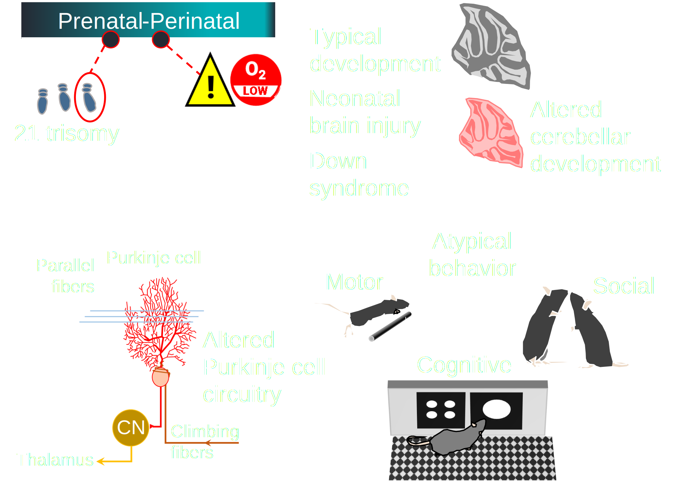
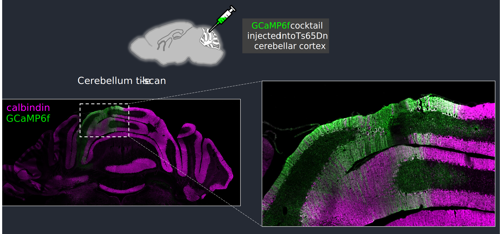
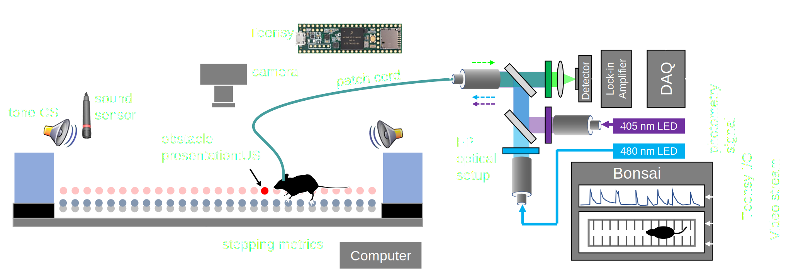

<section id="theme-overview">
  

    

      <h2>Cerebellar circuits in neurodevelopmental disorders</h2>
      
The big idea guiding our work is: Proper cerebellar development and circuit maturation ensures precise control of motor and non-motor behaviors at later stages.

      
Conversely: Altered cerebellar development due to early injury or genetic aberrations lead to atypical motor and non-motor behavior at later stages.

    

    

      
    

  

</section>

<section id="down-syndrome">
  

    

      <h2>Neural basis of locomotor dysfunction in Down Syndrome</h2>
      
Down syndrome (DS) is one of the most commonly diagnosed chromosomal conditions across the world. People with DS have atypical behaviors across different domains including the motor domain. However, the precise mechanism by which motor dysfunction occurs in DS remains unknown.

      
We are actively working on the neural basis of locomotor dysfunction in DS using a combination of advanced behavioral and <i>in vivo</i> optical tools in mouse models of DS.

    

    

      
      
    

  

</section>

<section id="injury">
  

    

      <h2>Neonatal brain injury and the cerebellar connectome</h2>
      
The developing cerebellum is particularly vulnerable to injury. A prevailing idea in the field is that injury to the cerebellum leads to long-term behavioral abnormalities due to disrupted connections between the cerebellum and the cortex

      
Our earlier work has shown that disruption of neonatal Purkinje cell activity leads to adaptive motor deficits. We are currently working to identify the role of how disrupted Purkinje cell firing during the early neonatal phase results in long-term consequences in connectivity and behavior

    

  

</section>

<section id="neurotech">
  

    

      <h2>Neuroengineering</h2>
      
We actively develop and integrate neuroengineering and neurotechnology tools to answer the questions we are most interested in. We accomplish this by using and contributing to <i>open science</i> initiatives including <a href="https://edspace.american.edu/openbehavior/">open behavior</a> and <a href = "https://open-neuroscience.com/">open neuroscience</a>. Some tools that we are currently developing and using in our research include:

      <ul>
      <li>Fiber photometry with genetically encoded Ca2+ indicators</li>
      <li>Advanced behavioral quantification using the ErasmusLadder</li>
      <li>Custom instrument and workflow design using open hardware and <a href="https://bonsai-rx.org/">Bonsai</a></li>
      <li>High density mapping of behavior using <a href="http://www.mackenziemathislab.org/deeplabcut">DeepLabCut</a></li>
      <li>Behavioral Data segmentation using unsupervised machine-learning algorithms such as <a href="https://bsoid.org/">B-SOID</a></li>
      <li>Image data segmentation pipelines incorporating deep-learning tools such as <a href="http://mib.helsinki.fi/help/main2/ug_gui_menu_tools_deeplearning.html">DeepMIB</a> and <a href="https://github.com/andreped/NoCodeSeg">NocodeSeg</a></li>
      <li>Miniscopes</li>
      </ul>
    
    
  

</section>

<iframe width="560" height="315" src="https://www.youtube.com/embed/gTvhfUoeraE" frameborder="0" allowfullscreen> </iframe>

 

<iframe width="560" height="315" src="https://www.youtube.com/embed/6taI63DGruQ" frameborder="0"  allowfullscreen></iframe>

 

<iframe width="560" height="315" src="https://www.youtube.com/embed/jLyQbThuNqc" frameborder="0"  allowfullscreen></iframe>

 

<iframe width="560" height="315" src="https://www.youtube.com/embed/1PUhv64-r2o" frameborder="0"  allowfullscreen></iframe>